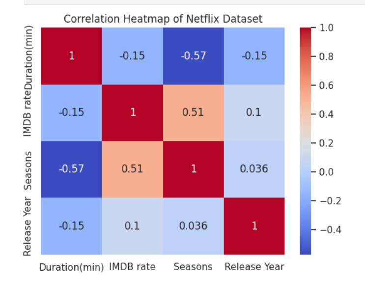

# 🎬 Netflix Data Analysis

This project explores a Netflix dataset using Python (pandas, seaborn) to identify patterns in duration, IMDb ratings, and release trends. It includes a correlation heatmap and data cleaning steps.

---

## 📁 Dataset
The dataset includes:
- Titles, Genres, IMDB ratings
- Age Ratings
- Duration (minutes)
- Content Type (TV Show or Movie)
- Seasons (for shows)
- Release Year
- Origin Country

---

## 📊 Key Insights
- Analyzed the correlation between duration, IMDb rating, release year, and number of seasons
- Generated a heatmap to show relationships between numerical features
- Identified trends in content release and ratings over the years

---

## 🔧 Tools Used
- Python 🐍
- pandas
- seaborn & matplotlib
- Jupyter Notebook

---

## 📈 Sample Visualization
  <!-- optional if you upload image -->

---

## 📬 Contact
Feel free to connect on [LinkedIn](https://linkedin.com/in/yourusername)
